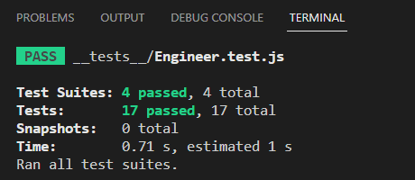

# team-profile-generator

A command-line application that dynamically generates a team profile HTML file using Node.js,  Inquirer and Jest for testing the application.

## Prerequisites
Node.js must be installed on your machine.        
The dependencies must be installed in your project directory.

## Installing
* To install Node.js, please follow the instructions on the official Node.js website.
* Clone the repository to your local machine.
* Open the terminal and navigate to the root directory of the cloned repository.

* To install dependencies for this application, open your terminal and run the following command:        
```$ npm i```

## Usage
* Run the following command to start the application:        
```$ node index.js```

You will be prompted to answer several questions about your team members.

Once you have answered all the questions, a team profile HTML file will be generated in the output folder.

## License

MIT License

## Tests

* For test run:        
```$ npm test```        
* Must pass all tests as shown in the image.        


## Built With

* Node.js
* Inquirer 
* Jest  
* JavaScript
